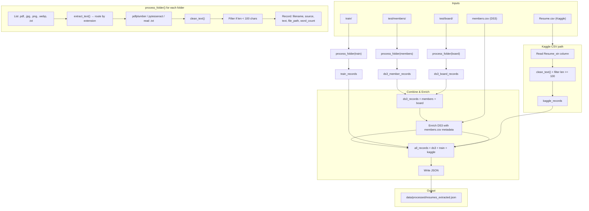

# 01 — Text Extraction Pipeline Flow

Mermaid diagram for `01_text_extraction.ipynb`: from raw sources to `resumes_extracted.json`.

## Summary

The **Process** box above is the pipeline inside each `process_folder()` call (used for members, board, and train).

| Step | What happens |
|------|----------------|
| **Extract** | `extract_text()` routes by extension → PDF (pdfplumber), images (OCR), or plain text. |
| **Clean** | `clean_text()` normalizes line endings, collapses whitespace, limits blank lines, strips non-printable ASCII. |
| **Filter** | Discard documents with cleaned text shorter than `MIN_TEXT_LENGTH` (100 chars). |
| **Folder run** | `process_folder(folder, source)` runs extract → clean → filter and returns list of records. |
| **Sources** | DS3 members + board, train folder, Kaggle CSV (Resume_str) each produce a record list. |
| **Enrich** | DS3 records are matched to `members.csv` and enriched with metadata. |
| **Merge** | All record lists are concatenated and written to `data/processed/resumes_extracted.json`. |
