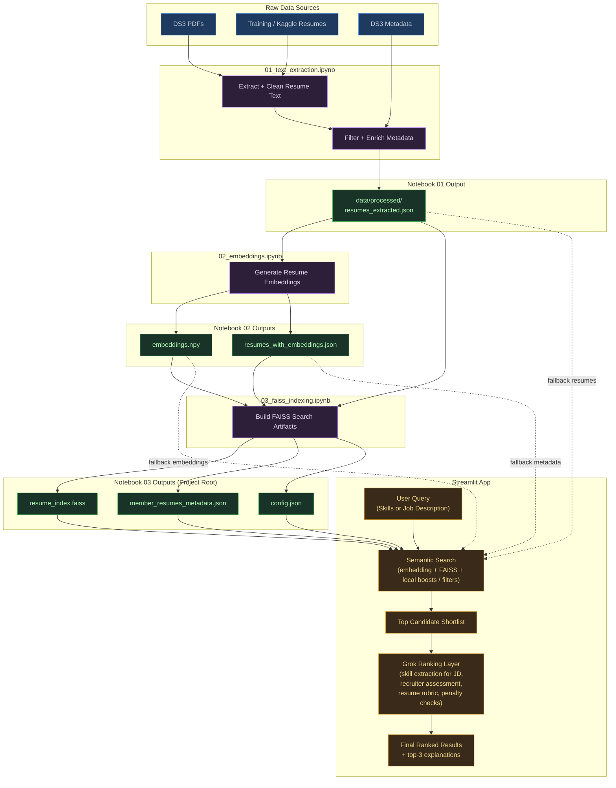

# TalentLens Pipeline

Data flow across 3 pipeline notebooks → Streamlit app.

## File flow summary

| Stage | Reads From | Writes To |
|-------|------------|-----------|
| **01_text_extraction** | `test/members/`, `test/board/`, `train/`, Kaggle CSV, `members.csv` | `data/processed/resumes_extracted.json` |
| **02_embeddings** | `data/processed/resumes_extracted.json` | `data/processed/embeddings.npy`, `data/processed/resumes_with_embeddings.json` |
| **03_faiss_indexing** | All 3 files in `data/processed/` | `resume_index.faiss`, `member_resumes_metadata.json`, `config.json` (project root) |
| **Streamlit app** | `resume_index.faiss`, `member_resumes_metadata.json`, `config.json` | — |
