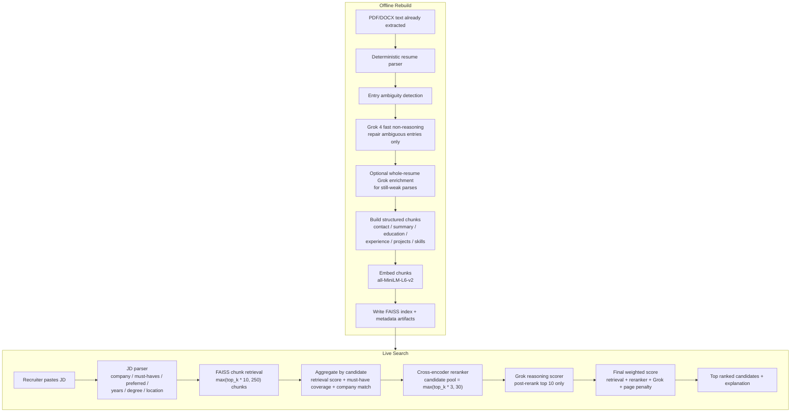

# TalentLens Current Pipeline

This is the current end-to-end pipeline in the codebase.



## Offline Rebuild

Used by:
- `pipeline/ds3_rebuild.py`

What it does:
- Rebuilds both `ds3_members` and `ds3_board`
- Runs deterministic parsing first
- Adds entry-level parse metadata:
  - `entry_parse_confidence`
  - `entry_parse_warnings`
  - `repair_source`
- Uses Grok non-reasoning only for ambiguous experience/project entries
- Optionally uses whole-resume Grok enrichment for weak parses that still need repair
- Rebuilds:
  - `data/processed/resumes_parsed.json`
  - `data/processed/resume_chunks.json`
  - `member_resumes_metadata.json`
  - `member_chunks_metadata.json`
  - `data/processed/ds3_chunk_embeddings.npy`
  - `resume_index.faiss`

## Online Search

Used by:
- `streamlit/search.py`
- `streamlit/app.py`
- `api.py`

What it does for job-description search:
- Parses the JD into structured requirements
- Retrieves chunks from FAISS
- Aggregates chunks into candidate profiles
- Applies company matching from structured experience data
- Reranks with the local cross-encoder
- Sends only the post-rerank top 10 candidates to Grok reasoning
- Computes the final score in code

Current important numbers:
- `GROK_TOP_N = 10`
- `GROK_MAX_WORKERS = 6` by default
- chunk retrieval = `max(top_k * 10, 250)`
- reranker candidate pool = `max(top_k * 3, 30)`
- page penalty = `0.04` when `page_count > 1`

Current final ranking formula:

```text
0.30 * retrieval_score
+ 0.20 * reranker_score
+ 0.15 * must_have_coverage
+ 0.20 * grok_fit_score
+ 0.15 * grok_resume_quality_score
- 0.04 if page_count > 1
```

## Grok Usage

Non-reasoning Grok:
- Offline only
- Repairs ambiguous resume parsing cases
- Can also enrich still-weak full resumes

Reasoning Grok:
- Online only
- Scores the post-rerank top 10 candidates against the JD
- Returns:
  - qualification match
  - company relevance
  - experience relevance
  - bullet quality
  - project strength
  - resume quality
  - matched/missing requirements
  - weakness flags
  - summary

## Startup Requirement

The app now fails loudly if either of these are unavailable:
- semantic FAISS retrieval
- local cross-encoder reranker

Run locally with the project virtualenv:

```bash
cd /Users/long/talent-lense/TalentLens_Public
source venv/bin/activate
set -a
source .env
set +a
streamlit run streamlit/app.py
```
